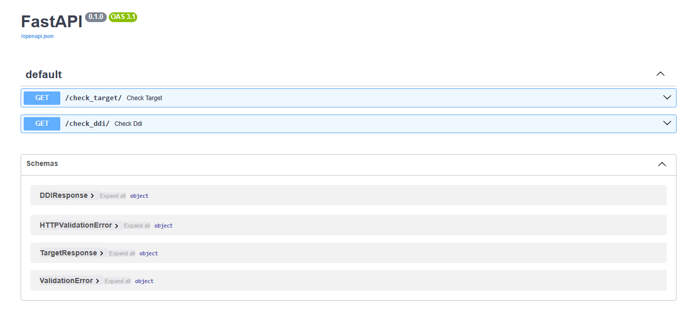

# Drug Interaction and Target Checker API

A **FastAPI** backend service that checks for shared receptor targets and **drug-drug interactions** (DDIs) with associated medical conditions and proportional reporting ratios (PRRs) using the TWOSIDES dataset between two drugs or ligands.

<p align="center">
  
  <br>
  <em>Example integration with the web-based frontend (see <a href="https://github.com/imtimtam/ddi-web">ddi-web</a>).</em>
</p>

## Features
- **`/check_target`**: Returns whether two drugs share a biological target.  
- **`/check_ddi`**: Returns known interactions between two drugs (condition → PRR mapping).  
- **`/full_interactions`**: Returns shared biological target and known interactions between two drugs. 
 - **`/drugs`**: Returns the full searchable list of drug names (used for autocomplete).  
- Case-insensitive and whitespace-insensitive drug concept name matching.  
- Preprocessing optimizations with frozenset dictionaries for efficient drug-drug pair lookups.  

## Data Setup
###### Full data files not included in repo due to size despite filtering. Follow **Instructions** below for full set. A smaller test sample will be provided here.
- Drug–Target interactions: `interactions.csv`  
- Drug–Drug Interactions (DDIs): `TWOSIDES_filtered.csv` 
#### Sample Data Instructions
1. Change line 8 of `main.py` to `twosides_path = "data/sample/TWOSIDES_sample.csv"`.

#### Full Data Instructions

1. Download `nsides/TWOSIDES.csv.gz` from the **Data and Source** section on nsides.io.
2. Move `TWOSIDES.csv.gz` to the `data/` folder.
3. Run the notebook `TWOSIDES_analysis.ipynb` to generate `TWOSIDES_trimmed.csv`.

## Getting Started

**1. Clone and move to the repository**

    git clone https://github.com/imtimtam/ddi-api

**2. Install dependencies**

    pip install -r requirements.txt

**3. Run FastAPI with Uvicorn**

    uvicorn main:app --reload

**4. Open browser and navigate to**

    http://127.0.0.1:8000/docs

## Endpoints and Usage



**1. Check shared targets**

**`GET /check_target/`**

**Query Parameters:**

- **drug1** – First drug name

- **drug2** – Second drug name

**Response Example (http://127.0.0.1:8000/check_target/?drug1=asenapine&drug2=apomorphine):**

```
{
  "interaction": true,
  "target": "5-HT<sub>1A</sub> receptor"
}
```

**2. Check drug-drug interactions**

**`GET /check_ddi/`**

**Query Parameters:**

- **drug1** – First drug name

- **drug2** – Second drug name

**Response Example (http://127.0.0.1:8000/check_ddi/?drug1=aspirin&drug2=ibuprofen) (truncated):**

```
{
  "interaction": true,
  "conditions_and_prr": {
    "Rectocele": 160,
    "Perforated ulcer": 120,
    "Oesophagitis haemorrhagic": 90,
    "Joint contracture": 60,
    "Cervicobrachial syndrome": 60,
    "Intervertebral disc space narrowing": 45,
    "Glomerulonephritis membranous": 45,
    "Bone marrow oedema": 40,
    "Right atrial dilatation": 40,
    "Hypoaldosteronism": 40,
    "Dental discomfort": 40,
    "Gingival erosion": 40,
    "Cardioactive drug level above therapeutic": 40,
    "Cerebral artery thrombosis": 40,
    "Generalised anxiety disorder": 40,
    "Product used for unknown indication": 40,
    "Cardiorenal syndrome": 30,
    ...
  }
}
```

**3. Check full drug-drug interactions with shared receptor targets**

**`GET /full_interactions/`**

**Query Parameters:**

- **drug1** – First drug name

- **drug2** – Second drug name

**Response Example (http://127.0.0.1:8000/full_interactions/?drug1=Diphenhydramine&drug2=Amitriptyline) (truncated):**

```
{
  "interaction": true,
  "targets": [
    "H<sub>1</sub> receptor"
  ],
  "conditions_and_prr": {
    "Onychomycosis": 70,
    "Compression fracture": 70,
    "Diverticulum intestinal": 60,
    "Osteolysis": 60,
    "Osteopenia": 60,
    "Kyphosis": 60,
    "Exposure via ingestion": 55,
    "Hypertensive heart disease": 50,
    "Diabetes mellitus non-insulin-dependent": 50,
    "Dental caries": 50,
    "Cardiotoxicity": 40,
    "Retinopathy": 40,
    "Protein total increased": 40,
    "Cervical spinal stenosis": 40,
    ...
  }
}
```

## License

This project is licensed under the MIT License.

## Credits

- **Guide to Pharmacology** – [https://www.guidetopharmacology.org](https://www.guidetopharmacology.org)  
  Provides information about drug targets and ligand interactions.

- **TWOSIDES Dataset** – [https://www.nsides.io](https://nsides.io/)  
  Contains drug-drug interactions and associated adverse event data.